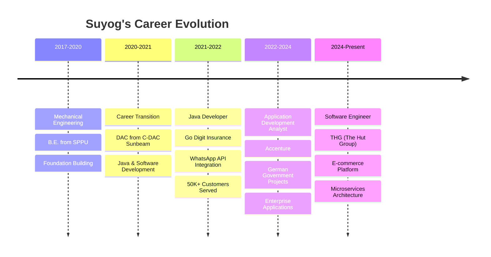

<div align="center">
  
# 👋 Hi there, I'm Suyog Bhole!
## 🚀 Enterprise Java Architect | Microservices Specialist | DevOps Engineer


[](https://www.linkedin.com/in/suyog-bhole)
[](https://github.com/bholesuyog)
[](mailto:bhole.suyog@gmail.com)
[](tel:+919403375364)

</div>

---

## 🚀 About Me


🔭 **Currently working at:** THG (The Hut Group) as Software Engineer  
🌱 **Expertise in:** Java, Spring Boot, Microservices, DevOps  
💼 **Experience:** 4.5+ years in Enterprise Software Development  
🏢 **Industries:** E-commerce, Insurance, Government Projects  
⚡ **Achievement:** Delivered projects 25% ahead of schedule consistently  
📧 **Contact:** bhole.suyog@gmail.com

---

## 💻 Tech Stack & Skills

<div align="center">


### 🔥 Core Technologies


### ⚡ Frameworks & Libraries


### ☁️ Cloud & DevOps


### 🗄️ Databases & Message Queues


### 🛠️ Development Tools


</div>

---

## 📊 Skill Proficiency

<div align="center">


### 🎯 Technical Expertise Levels


| 🚀 Technology | 📈 Proficiency Level |
|---------------|---------------------|
| **Java & Spring Boot** |  |
| **Microservices Architecture** |  |
| **REST APIs & Web Services** |  |
| **Docker & Kubernetes** |  |
| **Database Design & SQL** |  |
| **CI/CD & DevOps** |  |
| **Message Queues (ActiveMQ/Kafka)** |  |
| **Monitoring & Analytics** |  |


### 🏆 Expertise Distribution
```
🟢 Expert Level (85%+): Java, Spring Boot, REST APIs, Microservices
🔵 Advanced Level (80-84%): Docker, Kubernetes, Database Design, Message Queues
🟡 Proficient Level (75-79%): CI/CD, DevOps, Monitoring & Analytics
```

</div>

---

## 🏆 Professional Experience

<div align="center">

</div>

### 🚀 Software Engineer | THG (The Hut Group)
**June 2024 – Present**

- 🎯 **Onboarded 5+ major retail clients** (Matalan, MyProtein) within 3 months, **exceeding targets by 25%**
- ⚡ **Optimized backend APIs** improving response time by **40%**
- 🔄 **Implemented ActiveMQ solutions** reducing processing bottlenecks by **30%**
- 📊 **Configured real-time monitoring** reducing system downtime by **50%**
- 🚀 **Streamlined CI/CD workflows** decreasing deployment time from **45 to 15 minutes**

### 💼 Application Development Analyst | Accenture
**June 2022 – May 2024**

- 🏛️ **Developed enterprise Funding Finder app** for German Government serving **10,000+ users**
- 🔐 **Integrated Keycloak authentication** ensuring secure user management
- 🧪 **Achieved 85% code coverage** with comprehensive testing, reducing bugs by **60%**
- 📄 **Designed dynamic JSON templates** processing **500+ form submissions daily**
- 📊 **Built Spring Batch jobs** handling **1000+ records per batch**

### 🏥 Java Developer | Go Digit General Insurance
**June 2021 – June 2022**

- 📱 **Integrated WhatsApp Business API** serving **50,000+ customers**
- 🔧 **Developed 15+ REST APIs** reducing response time by **70%**
- 📞 **Onboarded 10+ business phone numbers** increasing engagement by **45%**
- ⭐ **Improved customer satisfaction** scores by **30%**

---

## 📈 GitHub Stats

<div align="center">
  


</div>

<div align="center">
  
[](https://git.io/streak-stats)

</div>

---

## 🏅 Key Achievements

<div align="center">

</div>

🎯 **Prevented 5000+ stuck orders** saving **$100K+ in operational costs**  
🚀 **Led development of Returns Manager** streamlining multi-application orchestration  
⚡ **Optimized development workflows** reducing development time by **70%**  
👨‍🏫 **Conducted AI-assisted development training** upskilling **20+ team members**  
📅 **Consistently delivered projects ahead of schedule** maintaining high quality standards  

---

## 🎓 Education & Professional Development

<div align="center">


### 🎓 Academic Background
**Bachelor of Engineering (B.E.) in Mechanical Engineering**
📍 Savitribai Phule Pune University, BSCOE, Pune
📅 August 2017 – August 2020
🎯 **CGPA:** 6.97/10

### 🚀 Professional Transformation
**Diploma in Advanced Computing (DAC)**
📍 C-DAC, Sunbeam Infotech Pvt. Ltd.
💡 *Career Transition: Mechanical Engineering → Software Development*

### 📜 Professional Certifications
<div align="center">


</div>

### 🏆 Academic to Industry Journey
```
Mechanical Engineering Graduate → Software Development Bootcamp → Java Developer → Senior Engineer
```

</div>

---

## 🚀 Career Progression Timeline

<div align="center">


### 📈 Professional Journey (2017-2024)



### 🎯 Growth Metrics
| Year | Role | Key Achievement | Impact |
|------|------|----------------|---------|
| 2021 | Java Developer | WhatsApp API Integration | 50K+ customers |
| 2022 | Analyst | German Gov Platform | 10K+ users |
| 2023 | Senior Analyst | Microservices Design | 85% code coverage |
| 2024 | Software Engineer | Client Onboarding | 25% above targets |

</div>

## 📊 Activity Graph

<div align="center">
  
[](https://github.com/ashutosh00710/github-readme-activity-graph)

</div>

---

## 🎯 Current Focus

<div align="center">

</div>

- 🔭 Working on **Microservices Architecture** optimization
- 🌱 Learning **Cloud Native Technologies** and **Kubernetes**
- 👯 Looking to collaborate on **Open Source Java Projects**
- 💬 Ask me about **Spring Boot, Microservices, DevOps**
- ⚡ Fun fact: I love optimizing systems and reducing deployment times!

---

## 📞 Let's Connect!

<div align="center">

 <em><b>I love connecting with different people</b> so if you want to say <b>hi, I'll be happy to meet you more!</b> :)</em>

[](https://www.linkedin.com/in/suyog-bhole)
[](https://github.com/bholesuyog)
[](mailto:bhole.suyog@gmail.com)

</div>

---

<div align="center">
  
### 💡 "Code is like humor. When you have to explain it, it's bad." – Cory House


</div>

---

<div align="center">

<br>
<em>Thanks for visiting! ⭐ Star some repositories if you find them interesting!</em>
</div>
